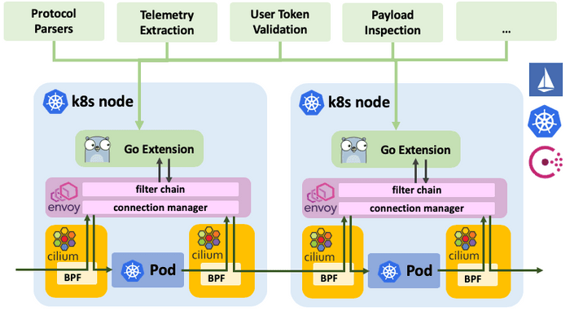
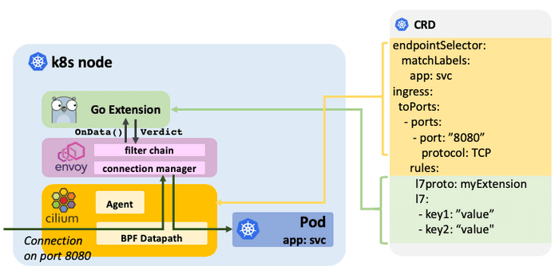

2018年10月23日，Cilium发布1.3版本，这个版本最大的亮点是引入了用于 Envoy 的 Go Extension ，并在 Envoy Go Extension的基础上实现了 Cassandra 和 Memcached 的协议解析器。详情见： 

- [Cilium 1.3: Go extensions for Envoy, Cassandra & Memcached Support](https://cilium.io/blog/2018/10/23/cilium-13-envoy-go/)

## Envoy Go extensions是什么?

Cilium一直依赖Envoy来处理HTTP和gRPC，以及自1.0版以来的Elasticsearch等HTTP派生。随着社区讨论如何扩展支持的L7协议的范围，很明显Envoy是推动未来协议添加的正确平台。重点迅速转向寻找简化Envoy可扩展性的方法，并允许重用现有的开源项目，如CNCF项目Vitess。 Envoy的Go扩展的想法诞生了。

在Cilium 1.3中，Cilium将Envoy的Go扩展作为Beta功能引入。



- **透明注入扩展:** 在Cilium的帮助下，连接被透明地重定向到Envoy，而无需修改应用程序或pod。 重定向基于目标端口进行配置，可以根据ingress和egress连接的标签，IP，DNS名称和服务名称限制为源或目标服务，并通过扩展名称映射到扩展的连接。重定向通过CiliumNetworkPolicy CRD或REST API进行配置。Envoy可以配置为在每个pod中作为sidecar运行，也可以作为独立代理运行，每个node一个。
- **完全分布式:** Go扩展是完全分布式的：Go扩展在Envoy内部，而Envoy运行在每个节点上或每个pod内，并且不需要集中式的控制平面进行数据处理。当然，go扩展本身可以调用任意控制平面组件来报告遥测或验证请求。
- **动态扩展映射:** Go扩展可作为共享库提供给Envoy。Cilium将Envoy配置为根据已配置的重定向自动加载相应的Go扩展，并在此连接有数据时调用它。未来版本将支持在运行时更新和重新加载扩展，而无需重新启动Envoy并且不会丢失连接状态。
- **通过CRD扩展配置:** Go扩展通过CRD或REST API使用通用键值对进行配置。这允许传递配置如安全策略，安全令牌或其他配置，而无需让Envoy意识到。
- **通用访问日志记录:** 通用访问日志记录：与配置类似，扩展可以返回通用键值对，这些键将进入访问日志，以允许将提取的可见性传递到访问日志层。
- **沙箱** 沙箱确保任何解析器不稳定都不会破坏Envoy成熟核心的稳定性。 在Matt Klein的帖子Exceptional Go的启发下，解析器被允许panic以引发异常。发生panic时，会将信息记录到访问日志中，并关闭与请求关联的TCP连接。

## 如何编写Envoy Go Extension？

为Envoy编写扩展很简单。 为了说明这一点，我们将为R2-D2控制协议实现一个基本协议解析器，并实现过滤逻辑以排除包含字符串“C-3PO”的任何控制请求。



实现扩展的主要API是 `OnData()` 函数，只要Envoy在通过`CiliumNetworkPolicy`映射到扩展的连接上接收到数据，就会调用该函数。该函数必须解析数据并返回以下判断之一：

- **MORE:** 解析器需要更多n个字节才能继续解析。
- **PASS:** 传递数据流的n个字节。
- **DROP:** 丢弃数据流的n个字节。
- **INJECT:** 在指定方向上注入n个字节的数据。
- **ERROR:** 发生解析错误，必须关闭连接。
- **NOP:** 什么都不做。

为了注册扩展，创建的parse factory必须实现Create（）函数。 只要Envoy建立了一个应该使用解析器的新连接，就会调用该函数。

```go
import (
        "github.com/cilium/cilium/proxylib/proxylib"
)

type parser struct{
        connection *proxylib.Connection
}

func (p *parser) OnData(reply, endStream bool, dataArray [][]byte) (proxylib.OpType, int) {
        data := string(bytes.Join(dataArray, []byte{}))
        msgLen := strings.Index(data, "\r\n")
        if msgLen < 0 {
                return proxylib.MORE, 1 // No delimiter, request more data
        }

        msgStr := data[:msgLen]
        msgLen += 2 // Inlcude the "\r\n" in the request

        if reply {
                return proxylib.PASS, msgLen // Pass responses without additional parsing
        }

        if strings.Contains(msgStr, "C-3PO") {
                return proxylib.DROP, msgLen
        }

        return proxylib.PASS, msgLen
}

type factory struct{}

func (f *factory) Create(connection *proxylib.Connection) proxylib.Parser {
        return &parser{connection: connection}
}

func init() {
        proxylib.RegisterParserFactory("r2d2", &factory{})
}
```

Finally, hook the new parser into the proxylib by importing the new parser package into the proxylib package. This will include the parser in the `libcilium.so` that is loaded by Envoy. Edit `proxylib/proxylib.go`:

最后，通过将新的parser包导入proxylib包，将新的解析器挂钩到proxylib。这将包括由Envoy加载的`libcilium.so` 中的parser。编辑 `proxylib/proxylib.go`：

```go
import (
        [...]
        _ "github.com/cilium/cilium/proxylib/r2d2"
)
```

上面的示例省略了扩展的配置，集成到策略存储库以及访问日志记录的所有方面。有关如何编写Go扩展的分步指南，请参阅 [Envoy Go Extensions](https://cilium.readthedocs.io/en/v1.3/envoy/extensions/) 。

## Cilium Go Extension 协议识别

> 备注：以下内容来自同事的分享，鸣谢！

以memcached extension为示例，CRD配置如下:

```yaml
apiVersion: "cilium.io/v2"
kind: CiliumNetworkPolicy
description: "Secure the Rebel memcached service"
metadata:
  name: "secure-rebel-alliance-memcache"
specs:
  - endpointSelector:
      matchLabels:
        app: memcached
    ingress:
    - fromEndpoints:
      - matchLabels:
          function: fleet-maintanence
      toPorts:
      - ports:
        - port: "11211"
          protocol: TCP
        rules:
          l7proto: memcache
          l7:
          - command: "writeGroup"
            keyPrefix: "alliance/fleet/"
          - command: "get"
            keyPrefix: "alliance/fleet/"
    - fromEndpoints:
      - matchLabels:
          function: fleet-monitoring
      toPorts:
      - ports:
        - port: "11211"
          protocol: TCP
        rules:
          l7proto: memcache
          l7:
          - command: "get"
            keyPrefix: "alliance/fleet/"
    - fromEndpoints:
      - matchLabels:
          role: jedi
      toPorts:
      - ports:
        - port: "11211"
          protocol: TCP
        rules:
          l7proto: memcache
          l7:
          - command:
```

配置的关键点在于ingress.fromEndpoints[],通过 matchLabels来选择endpoint，并指定port上的rule来标识指定endpoint上的特定端口的数据流需要通过哪个extension来处理。

协议规则下发流程如下：


1. 通过cilium policy import xxx.json 导入新策略
2. proxylib 内部有个client 会去获取 policy rule，并通过 PolicyUpdate 生成 Policy Instance，增加rule 到PolicyMap。相关实现请查阅：<https://github.com/cilium/cilium/blob/70a92b04cf5bdb72add0b7f70b7f19d2446f7eb5/proxylib/npds/client.go>
3. extension 中实现 Rule struct ，声明规则参数。如memcached rule：

    ```
    // Rule matches against memcached requests
    type Rule struct {
        // allowed commands
        commands memcacheCommandSet
        // compiled regex
        keyExact  []byte
        keyPrefix []byte
        regex     *regexp.Regexp

        empty bool
    }
    ```

4. extension 的OnData接口中，通过proxylib.connection.Matchs来匹配rule，然后实现特定的处理逻辑。


